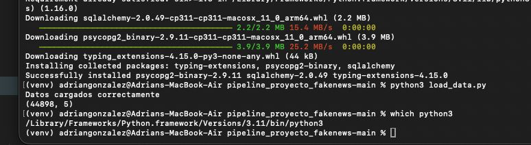
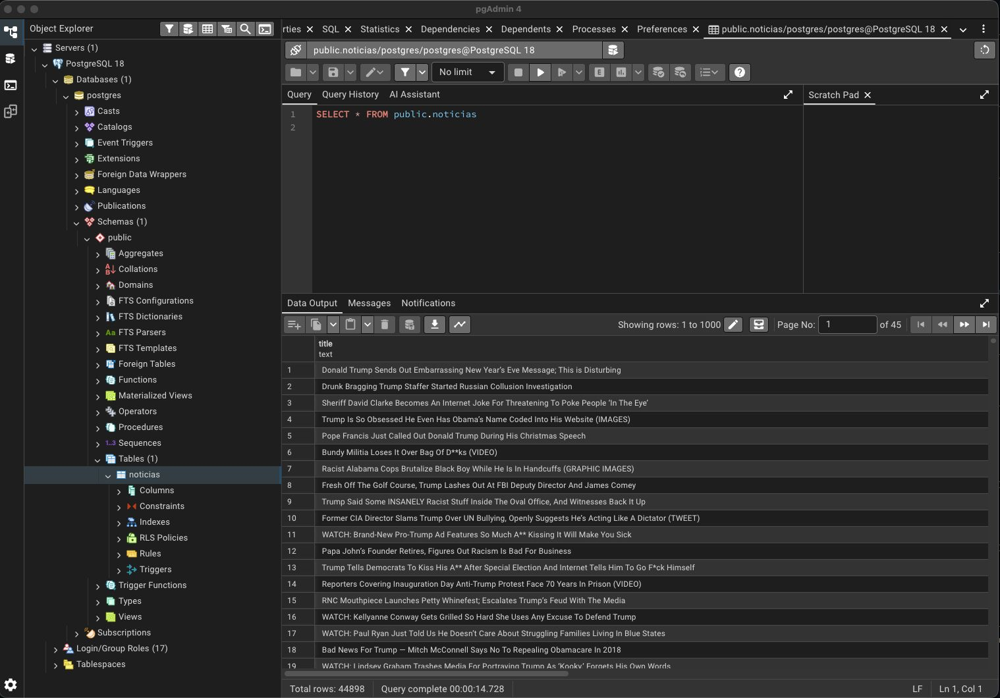
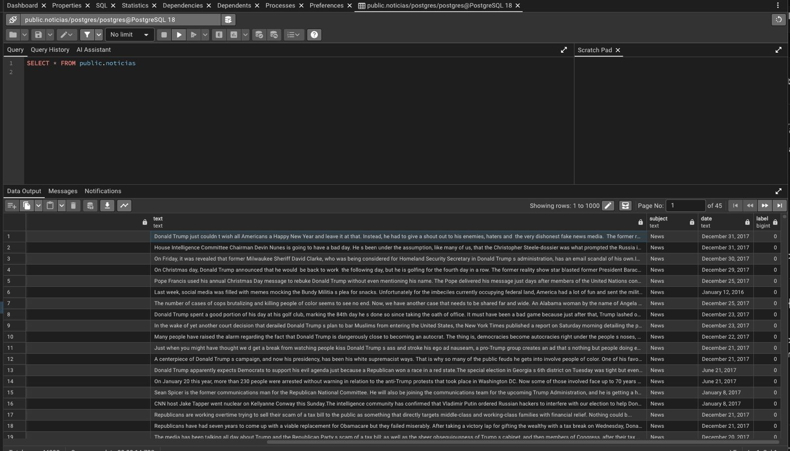
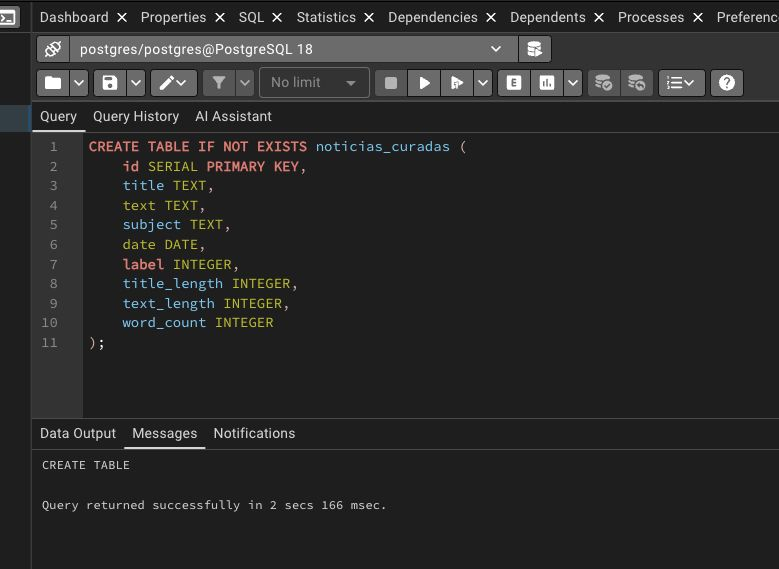
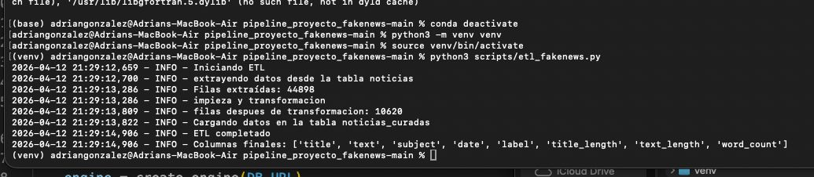
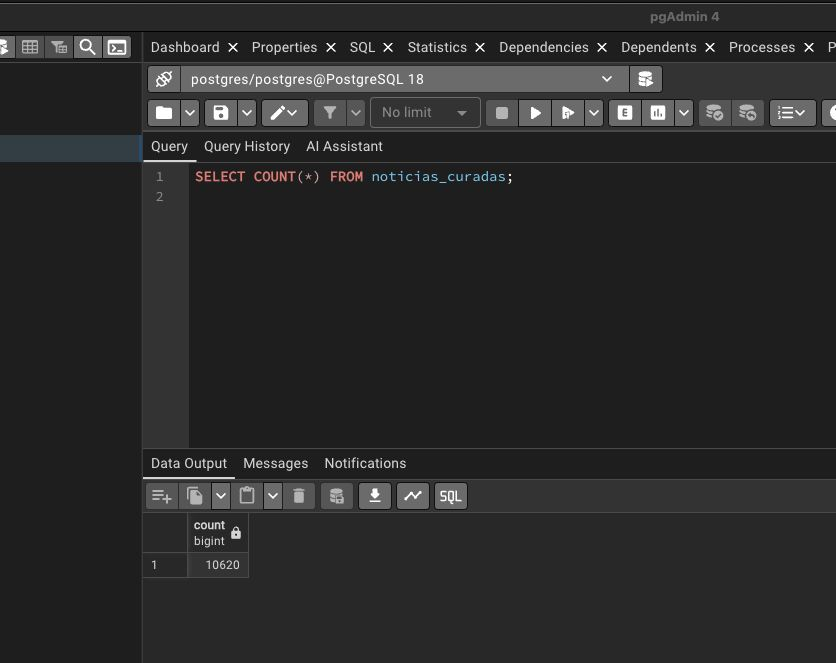
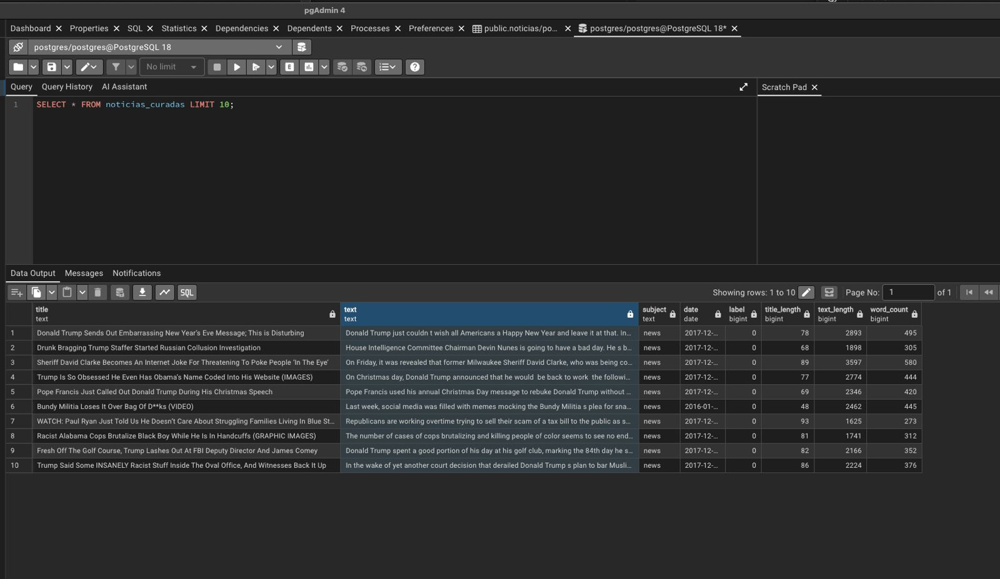

# Pipeline de Datos – ETL y Orquestación

## Descripción general

Nuestro objetivo es tomar los datos crudos almacenados en PostgreSQL, limpiarlos, transformarlos y generar un dataset final listo para ser utilizado por un modelo de inteligencia artificial.

---

## 1. Carga inicial de datos

Primero, ejecutamos el script `load_data.py`:

- Lee los archivos `Fake.csv` y `True.csv`
- Asigna etiquetas (0 = fake, 1 = real)
- Combina datasets
- Carga los datos en PostgreSQL en la tabla `noticias`

### Evidencia

---

## 2. Verificación de la base de datos

Validamos que la tabla `noticias` fue creada y contiene datos.

Esta tabla representa la capa de datos raw del pipeline.

### Evidencia

---

## 3. Creación de la tabla curada

Creamos una nueva tabla llamada `noticias_curadas`, que funciona como la capa final del ETL.

Esta tabla tiene los datos limpios y transformados.

### Evidencia

---

## 4. Proceso ETL

Se implementó un script `etl_fakenews.py` que realiza el proceso ETL completo.

### 4.1 Extracción

Extrtajimos los datos desde la tabla `noticias` en PostgreSQL.

### 4.2 Transformación

Aplicamos las transformaciones:

- Eliminación de valores nulos en `title` y `text`
- Eliminación de duplicados
- Limpieza de texto (espacios, formato)
- Conversión de la columna `date` a formato de fecha
- Creación de variables derivadas:
  - `title_length`: longitud del título
  - `text_length`: longitud del texto
  - `word_count`: número de palabras

### 4.3 Carga

Los datos transformados se cargan en la tabla `noticias_curadas`.

### Evidencia

---

## 5. Validación de datos

Implementamos un script `validate_pipeline.py` para verificar:

- Que la tabla final contiene datos
- Cantidad de filas
- Existencia de valores nulos

En caso de encontrar inconsistencias poco relevantes, se generan advertencias, pero el pipeline sigue.

### Evidencia

---

## 6. Orquestación del pipeline

Desarrollamos un script `orchestrator.py` que automatiza la ejecución del pipeline.

Este script ejecuta en orden:

1. Proceso ETL
2. Validación de datos

Esto nos permite correr todo el pipeline con un solo comando.

### Evidencia

---

## 7. Resultado final

Después del proceso ETL:

- Se redujo el dataset de 44,898 registros a 10,620 registros limpios
- Se generaron nuevas variables útiles para análisis y modelado
- Se creó un dataset final estructurado y listo para consumo

### Evidencia

---

## Conclusión

Implementamos un pipeline de datos completo:

- Base de datos (PostgreSQL)
- Proceso ETL
- Capa de datos curados
- Orquestación automatizada
- Validación del pipeline